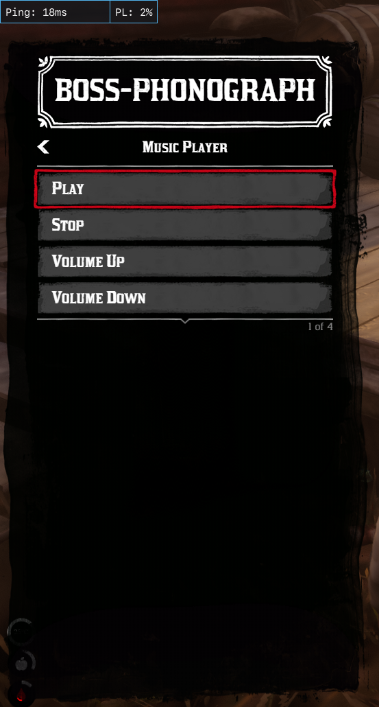
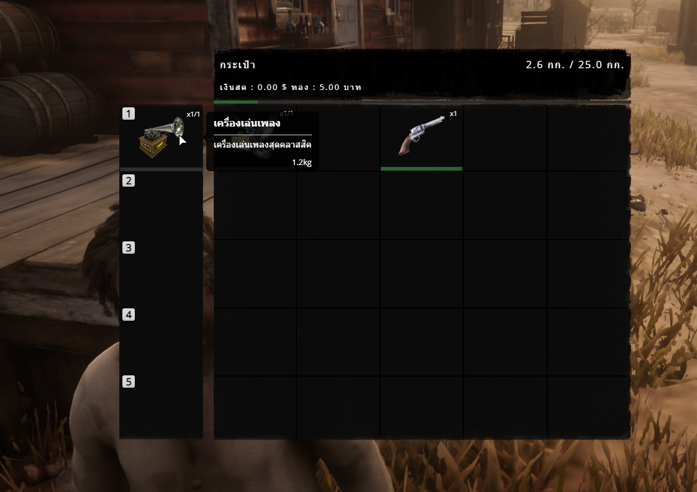
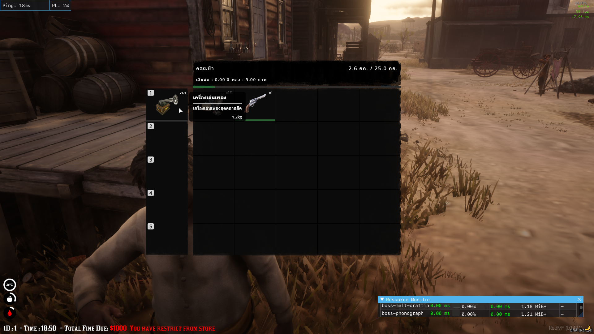
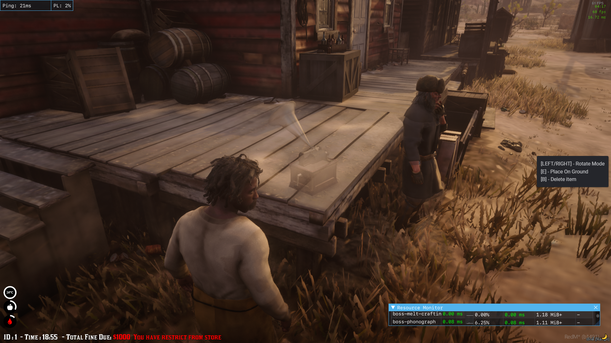
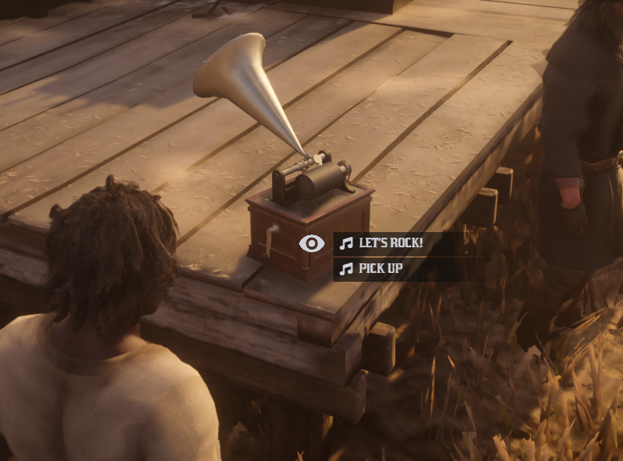

# BOSS-PHONOGRAPH (RSG V2)

added the phonograph music player to your server.
- **Warning:** This script works with RSG V2 ONLY! I'm only used RSG for RedM Development. Please do bridge for your framework yourself.

## Dependency
- [rsg-core](https://github.com/Rexshack-RedM/rsg-core) (awesome core)
  - Thanks alot to [@RSG RedM Framework](https://github.com/Rexshack-RedM)
- [rsg-target](https://github.com/Rexshack-RedM/rsg-target) (awesome 3d eye target to entity and actions)
  - Thanks alot to [@RSG RedM Framework](https://github.com/Rexshack-RedM)
- [ox_lib](https://github.com/overextended/ox_lib) (awesome input, notification, text ui)
  - Thanks alot to [@Overextended](https://github.com/overextended)
- [jo_lib](https://github.com/Jump-On-Studios/RedM-jo_libs) (awesome menu, notification)
  - Thanks alot to [Jump On Studios - FiveM/RedM](https://github.com/Jump-On-Studios)
- [xsound](https://github.com/Xogy/xsound) (awesome 3d music player)
  - Thanks alot to [@Xogy](https://github.com/Xogy)
## How to install
- Add this to "rsg-core/shared/items.lua" file
```lua
-- boss-phonograph
phonograph = { name = 'phonograph', label = 'Phonograph', weight = 1200, type = 'item', limit = 1, unique = true, useable = true, shouldClose = true, description = 'The classic music player', image = 'phonograph.png' },
```
- Add the image from img folder to "rsg-inventory/html/images" folder
  - Thanks alot to [@TankieTwitch](https://github.com/TankieTwitch/FREE-RedM-Image-Library) for the huge awesome image library

## Thanks a lot
- Thanks you to all who help to made this (I was put the credit on dependency section)
- I made this for my server and no problem. yes, for free. enjoy!
- Thanks to my assist the ChatGPT o1

## About me
- Discord: https://discord.gg/b5azUCkMRk
- Email: contact@bosshudsawat.com
- Personal: [bosshudsawat.com](https://bosshudsawat.com)

## Preview
[Click! Video Youtube Preview](https://youtu.be/V47HZyJny_4)





